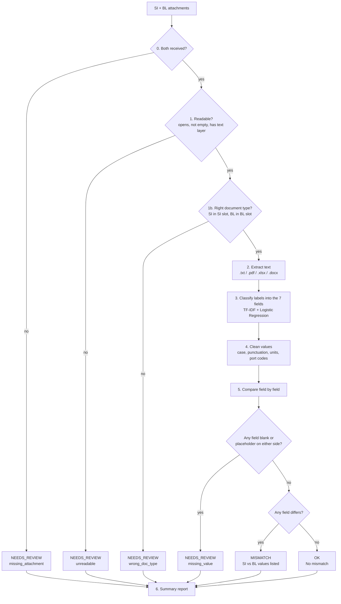

# Pipeline Workflow

How one Shipping Instruction (SI) and draft Bill of Lading (BL) are compared.

**Input:** an SI and a BL attachment from the same email.
**Output:** a verdict of `OK`, `MISMATCH` or `NEEDS_REVIEW`, plus a text report.

**Design rule:** ML is used in one place only, to decide which field a raw label means (step 3). Everything else is deterministic code, so every verdict can be explained.

---

## Flow



## Steps

### 0. Both attachments present?
If either the SI or the BL was never received, the pair goes to a human as `missing_attachment`. Nothing else is attempted.

### 1. Readability check
A file is `unreadable` if it can't be opened (corrupted, password-protected, unsupported type), is empty, or is a scanned picture with no text layer. The comparison is skipped, because comparing against an empty extraction would produce a misleading "everything is missing" report.

### 1b. Document type check
The title (first few non-empty lines) must fit the slot: an SI in the SI slot, a BL in the BL slot. An invoice, packing list or certificate of origin is `wrong_doc_type`. A title that isn't recognised is not rejected.

### 2. Extract text
Text is read from `.txt`, `.pdf`, `.xlsx` or `.docx`, then split into `(label, value)` pairs. Two splitters are used: `Label: Value` lines, and a "glued" splitter for PDFs where the label and value run together.

### 3. Classify labels
Each raw label is mapped to a canonical field by the trained classifier, so "Load Port", "POL" and "Port of Loading" all become `port_of_loading`. Bilingual labels such as `Gross Weight毛重(KGS)` are split by script and each part is scored separately. Labels below the confidence threshold (0.20) are listed for review instead of being used.

When a label appears more than once (a header and a total line, for example), the first value that looks right is kept. Gross weight must look like a bare number plus unit, which stops a table header from being read as the value.

### 4. Clean values
Values are normalised so formatting noise doesn't cause false mismatches: case, punctuation, thousands separators, units, port codes such as `(CNNTG)`, and line-break separators between a name and its address.

### 5. Compare
Each of the 7 fields ends in exactly one state:

| State | Meaning |
|-------|---------|
| `match` | Both documents have the field and the cleaned values are identical. |
| `mismatch` | Both have it, but the values differ. |
| `unsure` | Blank or a placeholder (`TBA`, `N/A`, `____MT`) on one or both documents. |

**The 7 fields:** shipper, consignee, notify party, port of loading, port of discharge, container count, gross weight.

The pair verdict is then:

| Condition | Verdict |
|-----------|---------|
| Any field `unsure` | `NEEDS_REVIEW`, reason `missing_value` (takes priority even if other fields also mismatch) |
| Else any field `mismatch` | `MISMATCH` |
| Else | `OK` |

### 6. Report
- All match: `No mismatch.`
- Any mismatch: `Mismatch detected.` followed by `[Field] SI: ... | BL: ...` for each one.
- Any unsure: `Require Human Intervention. Reason: missing_value`, with `{empty}` on the side that is missing.
- Any escalation: the same header with the reason and a line per problem.

## Review reasons

Every pair that needs a human says why. If several apply, the first in this order is the main reason and the rest are listed as details.

| Order | Reason | Cause |
|-------|--------|-------|
| 1 | `missing_attachment` | Only one of the SI / BL was received. |
| 2 | `unreadable` | Can't be opened, is empty, or is a scan with no text layer. |
| 3 | `wrong_doc_type` | Opened fine but isn't an SI / BL. |
| 4 | `missing_value` | A compared field is blank or a placeholder on either side. |

## Running it

```bash
python src/main.py                                   # demo on bundled pairs
python src/main.py path/to/SI.txt path/to/BL.txt     # one pair
python src/main.py --all data/sample_docs            # every SI/BL pair in a folder
python src/evaluate.py                               # score against data/ground_truth.json
```

The classifier must be trained once first: `python src/train_label_classifier.py`.

---

## Code map

Which file and function does each step of the flow.

| Step | File | Function / symbol |
|------|------|-------------------|
| Entry point, argument handling | `src/main.py` | `__main__` block, `run_pair`, `run_all`, `demo` |
| Orchestrates steps 0 to 6 for one pair | `src/main.py` | `analyze_pair` |
| Builds the `NEEDS_REVIEW` result | `src/main.py` | `_escalate` |
| Pairs `_SI` / `_BL` files by email id | `src/main.py` | `find_pairs` |
| 0. Missing attachment | `src/main.py` | `analyze_pair` (checks for `None` paths) |
| 1. Readability check, 2. read text | `src/extractor.py` | `extract_text`, `_read_txt_text`, `_read_xlsx_text`, `_read_docx_text`, `_read_pdf_text`, `UnreadableFile` |
| 1b. Document type check | `src/extractor.py` | `detect_doc_type`, `DOC_TYPE_NAME` |
| 2. Split text into label/value pairs | `src/extractor.py` | `read_document_pairs`, `_text_to_pairs`, `_delimited_pairs`, `_glued_pairs`, `_anchor_pattern` |
| 3. Classify labels | `src/extractor.py` | `classify_label`, `_label_variants`, `_get_model`, `CONFIDENCE_THRESHOLD` |
| 3. Pick one value per field | `src/extractor.py` | `_pick_value`, `_VALUE_SHAPE` |
| 1 to 3 combined per document | `src/extractor.py` | `extract_fields` |
| 4. Clean values | `src/compare.py` | `clean_value`, `PLACEHOLDER`, `PORT_FIELDS` |
| 5. Field-by-field comparison | `src/compare.py` | `compare_documents` (states `MATCH`, `MISMATCH`, `UNSURE`) |
| 5. Pair verdict | `src/compare.py` | `pair_status` (verdicts `PAIR_OK`, `PAIR_MISMATCH`, `PAIR_REVIEW`) |
| 6. Report text | `src/compare.py` | `format_report`, `format_escalation` |
| The 7 fields, review reasons, display names | `src/label_vocab.py` | `COMPARISON_FIELDS`, `ALL_FIELDS`, `REVIEW_REASONS`, `DISPLAY_NAME` |
| Label normalisation (shared by training and prediction) | `src/label_vocab.py` | `normalize_label` |

### Supporting scripts (not part of the per-pair flow)

| File | Purpose |
|------|---------|
| `src/train_label_classifier.py` | Trains the label classifier from `data/label_training_data.csv` and saves `models/label_classifier.joblib`. |
| `src/find_new_labels.py` | Scans a folder for unfamiliar labels and writes `data/candidate_labels.csv` for review. |
| `src/evaluate.py` | Runs the pipeline on `data/sample_docs` and scores it against `data/ground_truth.json`. |

### Data and model files

| Path | Role |
|------|------|
| `data/label_training_data.csv` | `(label_text, canonical_field)` training examples for the classifier. |
| `data/candidate_labels.csv` | Output of `find_new_labels.py`, to be reviewed and merged into the training data. |
| `data/ground_truth.json` | Expected verdicts per email. Read only by `evaluate.py`, never by the pipeline. |
| `data/sample_docs/` | SI/BL sample pairs used for evaluation. |
| `data/demo_docs/` | Pairs used by the no-argument demo, covering each review reason. |
| `models/label_classifier.joblib` | Trained classifier. Git-ignored, so rebuild it after cloning. |

### Where to change things

| To change... | Edit |
|--------------|------|
| Which fields are compared, or the review reasons | `src/label_vocab.py` |
| Which label maps to which field | `data/label_training_data.csv`, then retrain |
| How values are normalised | `src/compare.py` (`clean_value`) |
| How files are read or document types detected | `src/extractor.py` |
| Report wording | `src/compare.py` (`format_report`, `format_escalation`) |
